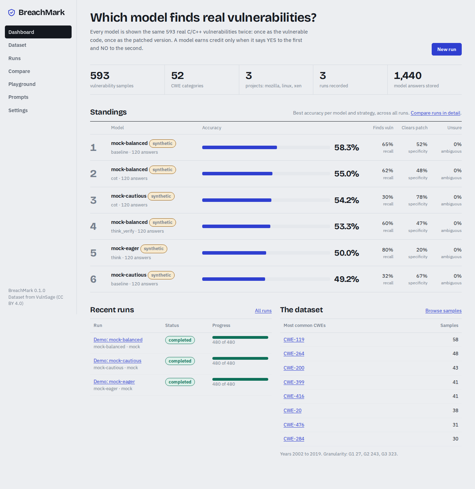

# BreachMark

A benchmark for breach-grade bugs: compare large language models on real-world vulnerability detection, from a web dashboard.

Every model is shown 593 real C/C++ vulnerabilities from the Linux kernel, Mozilla and Xen, twice each:
once as the vulnerable code (the right answer is YES) and once as the patched code (the right answer is NO).
BreachMark runs the questions, stores every answer, and turns them into standings, confusion matrices, per-CWE
heatmaps, majority-vote ensembles and exportable reports.



## What you can do

- **Run benchmarks** against Ollama (local models), any OpenAI-compatible server (OpenAI, LM Studio, vLLM,
  OpenRouter, llama.cpp) or Anthropic. Runs are resumable: pause, cancel, retry failures, survive restarts.
- **Compare models and prompt strategies**: accuracy with confidence intervals, recall on vulnerable code,
  specificity on patched code, F1, ambiguity rate, latency, tokens and cost.
- **Slice the results** by CWE, project, granularity, dataset noise and year.
- **Majority vote** across runs to see whether an ensemble beats the best single model.
- **Browse the dataset** with filters and a diff view of each fix.
- **Playground**: paste your own code or a public GitHub commit URL and ask a model about it.
- **Edit prompts**: the four built-in strategies are versioned templates; add your own.
- **Export** CSV for any run or comparison, and a standalone HTML report.
- **Try it with no model at all**: a built-in mock provider produces synthetic answers so you can see the whole
  app work before wiring up a real model (it is clearly labelled and proves nothing about any model).

## Quick start

Requires Python 3.10 or newer.

```bash
git clone https://github.com/VarshSec/breachmark.git
cd breachmark
python -m venv .venv
source .venv/bin/activate        # Windows: .venv\Scripts\activate
pip install -r requirements.txt
python -m breachmark
```

Open http://127.0.0.1:8000. The dataset is imported automatically on first start. Click **Run the demo** on
the dashboard to fill the app with synthetic results, or go to **Runs → New run** to use a real model.

### With Ollama

```bash
ollama pull qwen2.5-coder:7b        # or any model you like
python -m breachmark doctor ollama   # checks the connection and lists your models
python -m breachmark
```

Then create a run with provider **Ollama**. Keep *parallel requests* at 1 for a single GPU. The Ollama
context window option defaults to 16k tokens; raise it if you have the memory, since some samples are long.

### With OpenAI, Anthropic, or an OpenAI-compatible server

Put keys in a `.env` file (see `.env.example`), or paste them on the Settings page for the current session:

```
OPENAI_API_KEY=sk-...
ANTHROPIC_API_KEY=sk-ant-...
OPENAI_BASE_URL=http://localhost:1234/v1   # for LM Studio, vLLM, etc.
```

### Reaching it from another machine

Set `BREACHMARK_HOST=0.0.0.0` (or `--host 0.0.0.0`). The app then accepts any host name. There is no login,
so only do this on a network you trust, or put it behind a reverse proxy with authentication.

### From the command line, without the browser

```bash
python -m breachmark run --provider ollama --model qwen2.5-coder:7b --strategies baseline cot --limit 20
python -m breachmark run --provider openai --model gpt-4o-mini --cwe CWE-119 --concurrency 4
python -m breachmark doctor            # dataset, database and provider checks
python -m breachmark import other.csv  # load a different dataset with the same columns
```

Results from command-line runs show up in the web app too.

### Docker

```bash
docker build -t breachmark .
docker run -p 8000:8000 -v breachmark-data:/data \
  --add-host=host.docker.internal:host-gateway -e OLLAMA_HOST=http://host.docker.internal:11434 breachmark
```

## How a run works

1. You pick a provider and model, one or more prompt strategies, and a slice of the dataset (filters, a sample
   limit, a shuffle seed). The page shows how many model calls that is before you start.
2. For each sample, each strategy and each variant (vulnerable, patched) a task is created. Tasks run with the
   concurrency you chose, with retries and exponential backoff on transient errors. If ten tasks in a row fail,
   the run stops with the error shown, instead of burning through the dataset.
3. Each answer is parsed for a final `VERDICT: YES` or `VERDICT: NO` line (reasoning traces in `<think>` tags
   are ignored). If no verdict is found the answer is recorded as ambiguous, which counts as wrong. Optionally a
   judge model can be asked to read unclear answers.
4. Long code blocks are shortened in the middle to fit the input limit (default 40,000 characters) and the
   result is flagged as truncated, so you always know which answers saw the whole sample. You can also skip
   over-long samples or send them whole.

## Prompt strategies

The four built-in strategies follow the zero-shot prompting styles studied in the VulnSage paper:

| Strategy | What the model is asked to do |
|---|---|
| `baseline` | Answer YES or NO, nothing else |
| `cot` | Reason step by step (structure, patterns, exploitability), then decide |
| `think` | Reason inside a `<thinking>` block, then give an `<assessment>` with severity |
| `think_verify` | Analyse with confidence scores, verify high-confidence findings, then assess |

The wording is BreachMark's own and every template ends by asking for a verdict line. Saving a prompt creates a new
version; results keep pointing at the version that produced them, so old and new runs stay comparable.

## Metrics

- **Accuracy**: correct answers over all answers (ambiguous counts as wrong), with a 95% Wilson interval.
- **Finds vuln (recall)**: share of vulnerable samples answered YES.
- **Clears patch (specificity)**: share of patched samples answered NO. A model that says YES to everything gets
  100% recall and 0% specificity, so look at both.
- **Pair correct**: samples where both the vulnerable and the patched answer were right.
- **Ambiguous**: answers with no parseable verdict.

## Project layout

```
breachmark/
  app.py           FastAPI pages and JSON API
  runner.py        async job runner: workers, retries, pause/resume/cancel, circuit breaker
  runs.py          run creation, option validation, progress
  providers/       ollama, openai_compat, anthropic, mock
  prompts.py       built-in templates, rendering, truncation, versioning
  parsing.py       verdict extraction
  analytics.py     metrics, leaderboard, breakdowns, heatmap, ensembles
  importer.py      CSV → SQLite
  queries.py       dataset filtering
  diffview.py      diff between vulnerable and patched code
  playground.py    ad-hoc analysis of pasted code / commit diffs
  export.py        CSV export
  templates/       server-rendered pages
  static/          one stylesheet, one script, bundled fonts
data/vulnerabilities.csv   the dataset (CC BY 4.0, see data/README.md)
tests/             pytest suite (runs offline against the mock provider and fake HTTP servers)
```

The JSON API is documented at `/api/docs` while the app is running. Mutating requests require an
`X-BreachMark` header, which the app's own JavaScript sends; this stops other websites from triggering runs
through your browser.

## Running the tests

```bash
pip install -r requirements-dev.txt
python -m pytest -q
```

## Credits and license

BreachMark's code is released under the MIT License.

The dataset and the four prompting strategies come from **Reasoning with LLMs for Zero-Shot Vulnerability
Detection** by Arastoo Zibaeirad and Marco Vieira (2025), whose code and data are published at
[github.com/Erroristotle/VulnSage](https://github.com/Erroristotle/VulnSage) under MIT (code) and CC BY 4.0
(dataset). BreachMark is an independent tool built on that dataset; it shares no code with VulnSage. If you
publish results produced with BreachMark, please cite their paper:

```bibtex
@article{zibaeirad2025reasoning,
  title   = {Reasoning with LLMs for Zero-Shot Vulnerability Detection},
  author  = {Zibaeirad, Arastoo and Vieira, Marco},
  journal = {arXiv preprint arXiv:2503.17885},
  year    = {2025}
}
```

Fonts: Bricolage Grotesque and IBM Plex Sans, SIL Open Font License 1.1.
